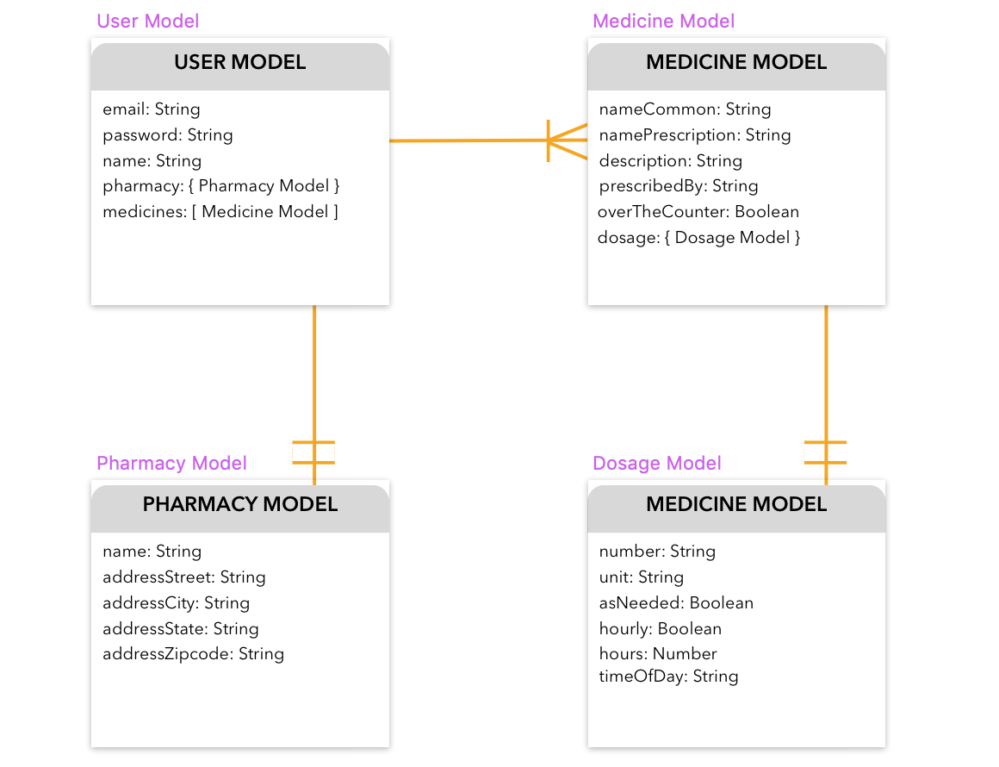
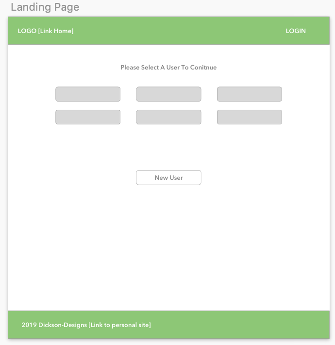
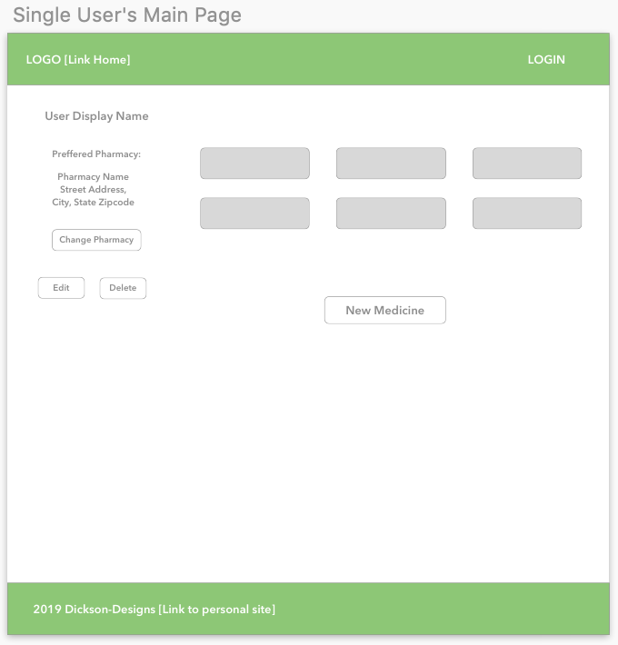

# Medicine App
Project 3: A medicine tracking app to help multiple users keep track of their many medicines. Inspired by years of making spreadsheets to keep track of family member's constantly changing medicine schedule.

Created using the MERN stack for Project 3 of Web Development Immersive at General Assembly. Inspired by a need to track a family member's many different medicines from many different doctors.

Deployed App: https://medicine-tracking-app.herokuapp.com/

Trello Board: https://trello.com/b/ne7pJ08o/project-3-medicine-app

### Links To Wireframes

Entity Relationship Diagram

### Technologies Used:
* Mongo
* Express 
* React 
* Node
* Materialize
* Styled Components
* Heroku
* Sketch (Wireframing/ERDs)

### Next Version Plans:
Due to HIPAA regulations, it is very important to add an authorization level to protect patient privacy. After that, I will be adding the option to check drug interactions with a third party API.

